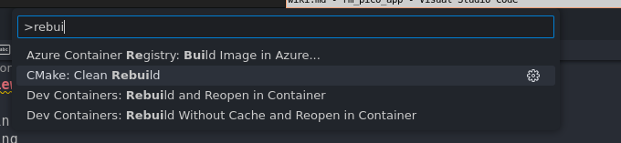

# Examples

## setting up stuff

Please go to [sample_rm_pico_app](https://github.com/agmui/sample_rm_pico_app#sample_rm_pico_app) readme

### compiling example folder files TODO

You can either compile the files in the examples folder or just copy the code form the guides and paste it in main.cpp

## hello world

```c++
#include <iostream>
#include "pico/stdlib.h" // the pico-sdk lib
#include <stdio.h>


int main(int argc, char const *argv[])
{
    stdio_init_all();// allows printing to terminal

    gpio_init(25);// init pin 25(the led)
    gpio_set_dir(25, GPIO_OUT);//set pin 25 to output

    while (1)
    {
        //print hello world
        std::cout << "hello world" << std::endl;

        // Turn On LED
        gpio_put(25, 1); // Set pin 25 to high
        sleep_ms(250);//wait for 250 ms
        printf("LED switched on!\n");// print 
        // Turn Off LED
        gpio_put(25, 0); // Set pin 25 to high.
        sleep_ms(250);
        printf("LED switched off!\n");

    }
}
```

## remote demo

```c++
#include <iostream>
#include <drivers.h>
#include <Debug.h>
#include "pico/stdlib.h"

int main(int argc, char const *argv[])
{
    //get drivers(controls basically everything)
    pico::Drivers *drivers = new pico::Drivers(); 
    // pico::Drivers *drivers = pico::Drivers::getDrivers();

    stdio_init_all();
    gpio_init(25);
    gpio_set_dir(25, GPIO_OUT);

    // init remote
    drivers->remote.initialize();
    while (1)
    {
        // Turn On LED
        gpio_put(25, 1); // Set pin 25 to high
        sleep_ms(250);
        printf("LED switched on!\n");
        // Turn Off LED
        gpio_put(25, 0); // Set pin 25 to high.
        sleep_ms(250);
        printf("LED switched off!\n");

        // ====
        std::cout << "." << std::endl;
        drivers->remote.read(); // Reading the remote before we check if it is connected yet or not.
        if (drivers->remote.isConnected())
        {
            // print out value
            std::cout << "remote: " << drivers->remote.getChannel(pico::communication::serial::Remote::Channel::LEFT_HORIZONTAL) << std::endl;
        }
    }
}

```

## Servos?

TODO:

## motor demo

```c++
#include <iostream>
#include <drivers.h>
#include <Debug.h>
#include "pico/stdlib.h"
#include "rm_pico_dev/src/algorithms/smooth_pid.hpp"

int main(int argc, char const *argv[])
{

    //sleep for a bit to let serial monitor connect
    for (int i = 0; i < 6; i++)
    {
        sleep_ms(1000);
        printf("%d,", 8 - i);
    }

    pico::Drivers *drivers = new pico::Drivers();
    // pico::Drivers *drivers = pico::Drivers::getDrivers();

    stdio_init_all();
    gpio_init(25);
    gpio_set_dir(25, GPIO_OUT);

    //init motor object
    pico::motor::DjiMotor motor_one = pico::motor::DjiMotor(drivers, pico::motor::MotorId::MOTOR1, pico::can::PioNum::CAN_BUS0, true, "ID1", 0, 0);

    // init PID algorithm
    // PID explained: https://www.youtube.com/watch?v=wkfEZmsQqiA
    static pico::algorithms::SmoothPidConfig pid_conf_dt = {20, 0, 0, 0, 8000, 1, 0, 1, 0, 0, 0};
    pico::algorithms::SmoothPid pidController = pico::algorithms::SmoothPid(pid_conf_dt);

    // init CanBus to send motor information
    drivers->can.initialize();

    //init motor
    motor_one.initialize();

    while (1)
    {
        std::cout << "=============" << std::endl;
        sleep_ms(550);
        // Turn On LED
        gpio_put(25, 1); // Set pin 25 to high
        sleep_ms(250);
        printf("LED switched on!\n");
        // Turn Off LED
        gpio_put(25, 0); // Set pin 25 to high.
        sleep_ms(250);
        printf("LED switched off!\n");

        std::cout << "poll" << std::endl;
        // checks to see if a msg is waiting
        drivers->motorHandler.pollCanData(); 

        std::cout << "pid" << std::endl;
        // do the pid algorithm 
        // PID explained: https://www.youtube.com/watch?v=wkfEZmsQqiA
        pidController.runControllerDerivateError(0 - motor_one.getShaftRPM(), 1);

        std::cout << "set output" << std::endl;
        // set up msg so its ready to be sent
        motor_one.setDesiredOutput(static_cast<int32_t>(pidController.getOutput()));

        std::cout << "send data" << std::endl;
        // send all msg to the motors
        drivers->motorHandler.encodeAndSendCanData();
    }
}
```

## multi motor demo

TODO:

## Ref System

TODO:
[ref system manual](https://rm-static.djicdn.com/tem/71710/RoboMaster%20Referee%20System%20Serial%20Port%20Protocol%20Appendix%20V1.5%EF%BC%8820230717%EF%BC%89.pdf)

## IMU demo

TODO:

## high lv uart demo

TODO:

## debugging class demo

TODO: 4 methods

## basic cli

```c++
#include <iostream>
#include <drivers.h>
#include <stdio.h>
#include "pico/stdlib.h"
#include <Command.h>


int main()
{
    stdio_init_all();

    for (int i = 0; i < 5; i++)
    {
        sleep_ms(1000);
        printf("%d,", 5 - i);
        if(getchar_timeout_us(100)!=-1) break;
    }

    pico::Drivers *drivers = new pico::Drivers();
    // pico::Drivers *drivers = pico::Drivers::getDrivers();

    gpio_init(25);
    gpio_set_dir(25, GPIO_OUT);


    while (1)
    {
        // waits like 1ms for cmd to come in
        // if nothing it continues
        drivers->debug.runNextCommand();
        // prevent the pico from turning into a 1 use smoke machine
        tight_loop_contents(); 
    }
}

```

## adding cli cmd

TODO:
you cant "sniff" any var, cuz u have drivers, or just run some test

```c++
#include <stdio.h>
#include "pico/stdlib.h"
#include <drivers.h>
#include <string>

// function to run when pilk is called
void pilk(pico::Drivers *drivers) 
{
    char pilk[] =
        "$$$$$$$\\ $$$$$$\\ $$\\       $$\\   $$\\ \n"
        "$$  __$$\\\\_$$  _|$$ |      $$ | $$  |\n"
        "$$ |  $$ | $$ |  $$ |      $$ |$$  / \n"
        "$$$$$$$  | $$ |  $$ |      $$$$$  /  \n"
        "$$  ____/  $$ |  $$ |      $$  $$<   \n"
        "$$ |       $$ |  $$ |      $$ |\\$$\\  \n"
        "$$ |     $$$$$$\\ $$$$$$$$\\ $$ | \\$$\\ \n"
        "\\__|     \\______|\\________|\\__|  \\__|\n\n";
    puts(pilk);// basically printf()

    // drivers is passed in so you can print out whatever you want
    printf("setting: %d\n", drivers->debug.getSetting());
}
int main()
{
    stdio_init_all();
    sleep_ms(1000);

    for (int i = 0; i < 4; i++)
    {
        sleep_ms(1000);
        printf("%d,", 4 - i);
        if (getchar_timeout_us(100) != -1)
            break;
    }
    puts("");// basically printf()

    pico::Drivers *drivers = new pico::Drivers();
    // setting up new cmd
    debugtools::cmd_def_t cmd = {pilk, 
                                 "pilk\n"
                                 "this is a sample cmd"};
    // debugtools::CLI::command_map.insert(std::make_pair("pilk", cmd));

    // adding new cmd to command_map
    debugtools::CLI::command_map["pilk"] = cmd;


    while (1)
    {
        // emulate stuff happening
        printf("doing stuff");
        sleep_ms(200);
        printf(".");
        sleep_ms(200);
        printf(".");
        sleep_ms(200);
        printf(".\n");

        // type in pilk to see output
        drivers->debug.runNextCommand();
    }
}
```

## cli sd card demo

```c++
#include <stdio.h>
#include "pico/stdlib.h"
#include <drivers.h>

int main()
{
    stdio_init_all();


    // lets Serial Monitor time to connect
    for (int i = 0; i < 3; i++)
    {
        sleep_ms(1000);
        printf("%d,", 3 - i);
        if(getchar_timeout_us(100)!=-1) break;
    }
    puts("");


    pico::Drivers *drivers = new pico::Drivers();

    std::cout << "mounting..." << std::endl;
    drivers->sdCard.init();// init sd card obj
    drivers->sdCard.mount();// mount sd card
    std::cout << "sdcard mounted" << std::endl;
    while (1)
    {

        // emulates stuff running on pico
        printf("doing stuff");
        sleep_ms(200);
        printf(".");
        sleep_ms(200);
        printf(".");
        sleep_ms(200);
        printf(".\n");

        //waits for cmd. If no cmd goes on
        drivers->debug.runNextCommand();
    }
}
```

## yaml/ any file reading stuff demo

TODO:

## retro term demo

currently only works well with Putty  
screen, minicom, and serial terminal have mixed results

```c++
#include <stdio.h>
#include <iostream>
#include "pico/stdlib.h"
// #include <retroTerm.h>

#include "rm_pico_dev/src/Debug/UI_tests/terminalTest.cpp"
// #include "widgetTest.cpp"

uint8_t widgetId = 0; //Record the widget ID globally
uint32_t numberOfClicks = 1; // Record the number of clicks

int main()
{
    stdio_init_all();

    for (int i = 0; i < 6; i++)
    {
        sleep_ms(1000);
        printf("%d,", 8 - i);
    }
    setup();

    while (1)
    {
        loop();
    }
    return 0;
}
```

# low level libs

From here on its recommend you don't mess with the pico-sdk because it may mess with the
rm_pico_dev. So only use its functions if you need to.

## basic input output

```c++
#include <stdio.h>
#include "pico/stdlib.h"

// guide: https://forums.raspberrypi.com/viewtopic.php?t=336230
int main(){
    //Initialise I/O
    stdio_init_all(); 

    // Initialise GPIO (Green LED connected to pin 25)
    gpio_init(25);
    gpio_set_dir(25, GPIO_OUT);

    char userInput;

    //Main Loop 
    while(1){
        //Get User Input
        printf("Command (1 = on or 0 = off):\n");
        userInput = getchar();

        if(userInput == '1'){
            // Turn On LED
            gpio_put(25, 1); // Set pin 25 to high
            printf("LED switched on!\n");
        }
        else if(userInput == '0'){
            // Turn Off LED
            gpio_put(25, 0); // Set pin 25 to high.
            printf("LED switched off!\n");
        }
        else{
            printf("Invalid Input!\n");
        }
    }
}
```

## basic shell

```c++
#include <stdio.h>
#include "pico/stdlib.h"
#include "hardware/uart.h"

int main()
{
    stdio_init_all();
    while (!stdio_usb_connected())
        ; // wait until USB connection
    char data[10]; // reading cmd buffer
    int chars_rxed = 0;
    while (1)
    {
        // emulates stuff happing
        printf("doing stuff");
        sleep_ms(200);
        printf(".");
        sleep_ms(200);
        printf(".");
        sleep_ms(200);
        printf(".\n");

        int ch = PICO_ERROR_TIMEOUT;
        do
        {
            // waits and checks for char
            // if no char continue
            ch = getchar_timeout_us(0);// returns PICO_ERROR_TIMEOUT if no char

            // saves char to buffer
            data[chars_rxed] = (char)ch;
            chars_rxed++;
        } while (ch != PICO_ERROR_TIMEOUT);// loop till char no more chars to read 

        data[chars_rxed - 1] = '\0';// add null char
        if (chars_rxed > 1)
            printf("%s\n", data);// print cmd
        chars_rxed = 0; //reset
    }
    return 0;
}
```

## sd card

from [simple_example](https://github.com/carlk3/no-OS-FatFS-SD-SPI-RPi-Pico/tree/master/simple_example)  
API for refrance: [no-OS-FatFS-SD-SPI-RPi-Pico](https://github.com/carlk3/no-OS-FatFS-SD-SPI-RPi-Pico#using-the-application-programming-interface)  
hw_config.c

```c++
/* hw_config.c
Copyright 2021 Carl John Kugler III

Licensed under the Apache License, Version 2.0 (the License); you may not use
this file except in compliance with the License. You may obtain a copy of the
License at

   http://www.apache.org/licenses/LICENSE-2.0
Unless required by applicable law or agreed to in writing, software distributed
under the License is distributed on an AS IS BASIS, WITHOUT WARRANTIES OR
CONDITIONS OF ANY KIND, either express or implied. See the License for the
specific language governing permissions and limitations under the License.
*/
/*

This file should be tailored to match the hardware design.

There should be one element of the spi[] array for each hardware SPI used.

There should be one element of the sd_cards[] array for each SD card slot.
The name is should correspond to the FatFs "logical drive" identifier.
(See http://elm-chan.org/fsw/ff/doc/filename.html#vol)
The rest of the constants will depend on the type of
socket, which SPI it is driven by, and how it is wired.

*/

#include <string.h>
//
#include "my_debug.h"
//
#include "hw_config.h"
//
#include "ff.h" /* Obtains integer types */
//
#include "diskio.h" /* Declarations of disk functions */

/* 
This example assumes the following hardware configuration:

|       | SPI0  | GPIO  | Pin   | SPI       | MicroSD   | Description            | 
| ----- | ----  | ----- | ---   | --------  | --------- | ---------------------- |
| MISO  | RX    | 16    | 21    | DO        | DO        | Master In, Slave Out   |
| MOSI  | TX    | 19    | 25    | DI        | DI        | Master Out, Slave In   |
| SCK   | SCK   | 18    | 24    | SCLK      | CLK       | SPI clock              |
| CS0   | CSn   | 17    | 22    | SS or CS  | CS        | Slave (or Chip) Select |
| DET   |       | 22    | 29    |           | CD        | Card Detect            |
| GND   |       |       | 18,23 |           | GND       | Ground                 |
| 3v3   |       |       | 36    |           | 3v3       | 3.3 volt power         |

*/

// Hardware Configuration of SPI "objects"
// Note: multiple SD cards can be driven by one SPI if they use different slave
// selects.
static spi_t spis[] = {  // One for each SPI.
    {
        .hw_inst = spi0,  // SPI component
        .miso_gpio = 16,  // GPIO number (not Pico pin number)
        .mosi_gpio = 19,
        .sck_gpio = 18,

        // .baud_rate = 1000 * 1000
        .baud_rate = 12500 * 1000
        // .baud_rate = 25 * 1000 * 1000 // Actual frequency: 20833333.
    }};

// Hardware Configuration of the SD Card "objects"
static sd_card_t sd_cards[] = {  // One for each SD card
    {
        .pcName = "0:",   // Name used to mount device
        .spi = &spis[0],  // Pointer to the SPI driving this card
        .ss_gpio = 17,    // The SPI slave select GPIO for this SD card
        .use_card_detect = true,
        .card_detect_gpio = 22,  // Card detect
        .card_detected_true = 1  // What the GPIO read returns when a card is
                                 // present.
    }};

/* ********************************************************************** */
size_t sd_get_num() { return count_of(sd_cards); }
sd_card_t *sd_get_by_num(size_t num) {
    if (num <= sd_get_num()) {
        return &sd_cards[num];
    } else {
        return NULL;
    }
}
size_t spi_get_num() { return count_of(spis); }
spi_t *spi_get_by_num(size_t num) {
    if (num <= spi_get_num()) {
        return &spis[num];
    } else {
        return NULL;
    }
}

/* [] END OF FILE */

```

main.cpp

```c++
#include <stdio.h>
//
#include "f_util.h"
#include "ff.h"
#include "pico/stdlib.h"
#include "rtc.h"
//
#include "hw_config.h"

/**
 * 
 * NOTE: make sure to add add_executable(rm_pico_dev app/main.cpp app/hw_config.c)
 * in cmake
 * 
 */
int main() {
    stdio_init_all();
    time_init();

    sleep_ms(3000);

    puts("Hello, world!");

    // See FatFs - Generic FAT Filesystem Module, "Application Interface",
    // http://elm-chan.org/fsw/ff/00index_e.html
    sd_card_t *pSD = sd_get_by_num(0);
    FRESULT fr = f_mount(&pSD->fatfs, pSD->pcName, 1);
    if (FR_OK != fr) panic("f_mount error: %s (%d)\n", FRESULT_str(fr), fr);
    FIL fil;
    const char* const filename = "filename.yaml";
    fr = f_open(&fil, filename, FA_OPEN_APPEND | FA_WRITE);
    if (FR_OK != fr && FR_EXIST != fr)
        panic("f_open(%s) error: %s (%d)\n", filename, FRESULT_str(fr), fr);
    if (f_printf(&fil, "Hello: world!\n") < 0) {
        printf("f_printf failed\n");
    }
    fr = f_close(&fil);
    if (FR_OK != fr) {
        printf("f_close error: %s (%d)\n", FRESULT_str(fr), fr);
    }
    f_unmount(pSD->pcName);

    puts("Goodbye, world!");
    for (;;);
}

```

## basic uart

go to pico-example lib

## dbus demo

uses irq and mostly taken from [basic uart](#basic-uart)  
[dbus decoding guide](https://drive.google.com/file/d/1a5kaTsDvG89KQwy3fkLVkxKaQJfJCsnu/view)

```c++
/**
 * Copyright (c) 2020 Raspberry Pi (Trading) Ltd.
 *
 * SPDX-License-Identifier: BSD-3-Clause
 */

#include "pico/stdlib.h"
#include "hardware/uart.h"
#include "hardware/irq.h"
#include <stdio.h>
#include <iostream>

/// \tag::uart_advanced[]

// uart settings
#define UART_ID uart0
#define BAUD_RATE 100000
#define DATA_BITS 8
#define STOP_BITS 1
#define PARITY UART_PARITY_EVEN

// We are using pins 0 and 1, but see the GPIO function select table in the
// datasheet for information on which other pins can be used.
#define UART_TX_PIN 0
#define UART_RX_PIN 1

static int chars_rxed = 0;
static uint8_t data[18]{0};
static uint8_t save_data[18]{0};
uint32_t last_read = 0;

void parse_data()
{
    printf("\nBREAK: ");
    for (int i = 0; i < 18; i++)
    {
        printf("%x,", data[i]);
        save_data[i] = data[i];
        data[i] = 0;
    }
    printf("\n");
    chars_rxed = 0;
}

// RX interrupt handler
void on_uart_rx()
{
    if (time_us_32() - last_read > 300)
    {
        // std::cout << time_us_32() - last_read << std::endl;
        chars_rxed = 0;
    }
    while (uart_is_readable(UART_ID))
    {
        uint8_t ch = uart_getc(UART_ID);
        last_read = time_us_32();
        // printf("ch: %#x\n", ch);
        data[chars_rxed] = ch;
        chars_rxed++;

        if (chars_rxed >= 18)
            parse_data();

    }
}
int main()
{
    // Set up our UART with a basic baud rate.
    uart_init(UART_ID, BAUD_RATE); // 2400);

    // Set the TX and RX pins by using the function select on the GPIO
    // Set datasheet for more information on function select
    gpio_set_function(UART_TX_PIN, GPIO_FUNC_UART);
    gpio_set_function(UART_RX_PIN, GPIO_FUNC_UART);

    // Actually, we want a different speed
    // The call will return the actual baud rate selected, which will be as close as
    // possible to that requested
    // int __unused actual = uart_set_baudrate(UART_ID, BAUD_RATE);

    // Set UART flow control CTS/RTS, we don't want these, so turn them off
    uart_set_hw_flow(UART_ID, false, false);

    // Set our data format
    uart_set_format(UART_ID, DATA_BITS, STOP_BITS, PARITY);

    // Turn off FIFO's - we want to do this character by character
    uart_set_fifo_enabled(UART_ID, false);

    // Set up a RX interrupt
    // We need to set up the handler first
    // Select correct interrupt for the UART we are using
    int UART_IRQ = UART_ID == uart0 ? UART0_IRQ : UART1_IRQ;

    // And set up and enable the interrupt handlers
    irq_set_exclusive_handler(UART_IRQ, on_uart_rx);
    irq_set_enabled(UART_IRQ, true);

    // Now enable the UART to send interrupts - RX only
    uart_set_irq_enables(UART_ID, true, false);

    // OK, all set up.
    // Lets send a basic string out, and then run a loop and wait for RX interrupts
    // The handler will count them, but also reflect the incoming data back with a slight change!
    // uart_puts(UART_ID, "\nHello, uart interrupts\n");

    const uint LED_PIN = PICO_DEFAULT_LED_PIN;
    gpio_init(LED_PIN);
    gpio_set_dir(LED_PIN, GPIO_OUT);
    stdio_init_all();
    while (1)
    {

        printf(".");
        gpio_put(LED_PIN, 1);
        sleep_ms(250);
        gpio_put(LED_PIN, 0);
        sleep_ms(250);
    }
}


```

## 2 way pico to pico canbus communication

can2040 [API](https://github.com/KevinOConnor/can2040/blob/master/docs/API.md)

pico_transmit.cpp

```c++
#include <stdio.h>
#include "pico/stdlib.h"
#include "hardware/pio.h"
extern "C"
{
#include "can2040.h"
}
#include "RP2040.h"

typedef struct can2040_msg CANMsg;
static struct can2040 cbus;

static void
can2040_cb(struct can2040 *cd, uint32_t notify, struct can2040_msg *msg)
{
}

static void
PIOx_IRQHandler(void)
{
    can2040_pio_irq_handler(&cbus);
}

void canbus_setup(void)
{
    uint32_t pio_num = 0;
    uint32_t sys_clock = 125000000, bitrate = 500000;
    uint32_t gpio_rx = 4, gpio_tx = 5;

    // Setup canbus
    can2040_setup(&cbus, pio_num);
    can2040_callback_config(&cbus, can2040_cb);

    // Enable irqs
    irq_set_exclusive_handler(PIO0_IRQ_0_IRQn, PIOx_IRQHandler);
    NVIC_SetPriority(PIO0_IRQ_0_IRQn, 1);
    NVIC_EnableIRQ(PIO0_IRQ_0_IRQn);

    // Start canbus
    can2040_start(&cbus, sys_clock, bitrate, gpio_rx, gpio_tx);
}

const char *pilk = "pilk";
int main()
{
    stdio_init_all();
    canbus_setup();

    const uint LED_PIN = PICO_DEFAULT_LED_PIN;
    gpio_init(LED_PIN);
    gpio_set_dir(LED_PIN, GPIO_OUT);
    while (true)
    {
        CANMsg msg = {0};
        msg.dlc = 8;
        msg.id = 0x200;
        // clear buffer
        msg.data[0] = 0x00;
        msg.data[1] = 0x00;
        msg.data[2] = 0x00;
        msg.data[3] = 0x00;
        msg.data[4] = 0x00;
        msg.data[5] = 0x00;
        msg.data[6] = 0x00;
        msg.data[7] = 0x00;

        for (int i = 0; i < 5; i++)
        {
            msg.data[i] = (int)*(pilk + i);
        }

        int res = can2040_transmit(&cbus, &msg);
        printf("Sending! PILK returned: %d\n", res);

        // printf("LED ON!\n");
        gpio_put(LED_PIN, 1);
        sleep_ms(250);
        // printf("LED OFF!\n");
        gpio_put(LED_PIN, 0);
        sleep_ms(250);
    }

    return 0;
}

```

pico_receive.cpp

```c++
#include <stdio.h>
#include "pico/stdlib.h"
#include "hardware/pio.h"
extern "C"
{
#include "can2040.h"
}
#include "RP2040.h"

typedef struct can2040_msg CANMsg;
static struct can2040 cbus;

static void
can2040_cb(struct can2040 *cd, uint32_t notify, struct can2040_msg *msg)
{
    if (notify == CAN2040_NOTIFY_RX)
    {
        printf("msg read: ");
        printf("%s\n", msg->data);
    }
}

static void
PIOx_IRQHandler(void)
{
    can2040_pio_irq_handler(&cbus);
}

void canbus_setup(void)
{
    uint32_t pio_num = 0;
    uint32_t sys_clock = 125000000, bitrate = 500000;
    uint32_t gpio_rx = 4, gpio_tx = 5;

    // Setup canbus
    can2040_setup(&cbus, pio_num);
    can2040_callback_config(&cbus, can2040_cb);

    // Enable irqs
    irq_set_exclusive_handler(PIO0_IRQ_0_IRQn, PIOx_IRQHandler);
    NVIC_SetPriority(PIO0_IRQ_0_IRQn, 1);
    NVIC_EnableIRQ(PIO0_IRQ_0_IRQn);

    // Start canbus
    can2040_start(&cbus, sys_clock, bitrate, gpio_rx, gpio_tx);
}

int main()
{
    stdio_init_all();
    canbus_setup();

    const uint LED_PIN = PICO_DEFAULT_LED_PIN;
    gpio_init(LED_PIN);
    gpio_set_dir(LED_PIN, GPIO_OUT);
    while (true)
    {
        printf("waiting...\n");

        // printf("LED ON!\n");
        gpio_put(LED_PIN, 1);
        sleep_ms(250);
        // printf("LED OFF!\n");
        gpio_put(LED_PIN, 0);
        sleep_ms(250);
        // sleep_ms(1000);
    }

    return 0;
}

```

---

# Other Examples in Lib Dir

There are other examples in each submodule

pico-sdk:  

* [pico-examples](https://github.com/raspberrypi/pico-examples)

sd card stuff:  

* [simple_example](https://github.com/carlk3/no-OS-FatFS-SD-SPI-RPi-Pico/tree/master/simple_example)  
* [example](https://github.com/carlk3/no-OS-FatFS-SD-SPI-RPi-Pico/tree/master/example)

can2040:  

* [API](https://github.com/KevinOConnor/can2040/blob/master/docs/API.md)

pico-arduino-compat demo

* [retroTerm](https://github.com/ncmreynolds/retroTerm/tree/main/examples/Example04_singleButton)
* [way to run arduino lib](https://github.com/fhdm-dev/pico-arduino-compat)

---

# General lib overview

The library is a port from [taproot](https://github.com/uw-advanced-robotics/taproot)
to work on the pico.

### drivers

The drivers class is a [singleton](https://refactoring.guru/design-patterns/singleton)
and has everything. If you need to do any library operation it is General through the
drivers object.
ex:

```c++
drivers->remote.isConnected();
drivers->motorHandler.pollCanData(); 
...
```

see the [examples](#examples) to learn more.

### debug tools

The Debug class and debugtools namespace in general is not from taproot. It is a collection of tools
to make it easier to debug the pico.
It has a [CLI](#basic-cli) and [SD card](#sd-card) class.

#### CLI

The CLI class can be conneted to
the serial monitor and have commands sent to it via the usb cable. This is so you can "peek"
at any value or inter state such as the motor position or write simple tests to run on the pico.
To do this can just add your own commands with this [add demo](#adding-cli-cmd).

#### SD card

The SD card class is so we could store config files that we could just load.
Or have a logger to record everything that happens. For example, say power is cut
mid match or the pico crashes. We would have a log of what happened to debug.

### pico-sdk

You are allowed to use the pico-sdk library but it is advised not to because the rm_pico_dev library
handles most of the states and ports in the sdk so messing with the sdk may have consequences.
Only use the sdk if you absolutly must.

### pin definitions

All pin definition are in board.h and they are all the gpio pin number.

### final notes

LEARN WAT NAME SPACES R

---

# writing tests

## CTests

## Wokwi Tests

see Wokwi [section](#writing-wokwi-tests)

---

# CMake intro TODO: add link to sample_rm_pico_app readme

This guide is mainly for my robotics team. If you want to learn about cmake you can read this guide or go to any online guide.

## vscode

cmake tab:  
  
chooses what to build

build all:  
same as `f7` or `ctrl+shift+b`  


just build docs:  
  
the output will be in: `build/rm_pico_dev/docs/html/index.html`  
to view double click the file and open in browser

you can also just choose what other libs to build

If you getting weird cmake erros sometimes just run:  


choose kit:  


choose what to build:  
  
then click to build:  


---

# idk more about Wokwi TODO: add link to sample_rm_pico_app readme

## making custom chips(dji remote, refsystem etc)

## writing wokwi tests

## git auto testing wokwi

[github's explanation](https://docs.github.com/en/actions/quickstart)

## change config

